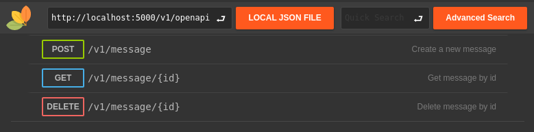
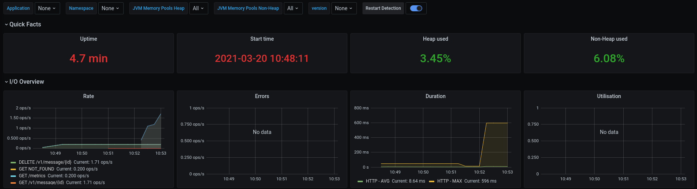
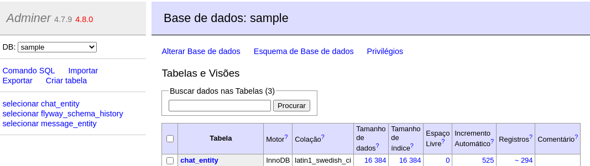

[](https://www.codacy.com/gh/helpdeveloper/java-modular-architecture/dashboard?utm_source=github.com&amp;utm_medium=referral&amp;utm_content=helpdeveloper/java-modular-architecture&amp;utm_campaign=Badge_Grade)
[](https://coveralls.io/github/helpdeveloper/java-modular-architecture?branch=main)
# Arquitetura modular

O objetivo do bom design de software, como já diria Robert C. Martin, em seu livro 'Clean Architecture: A Craftsman's Guide to Software Structure and Design', é minimizar os recursos humanos necessários para construir e manter um determinado sistema.

Esse projeto é inspirado em situações e dificuldades reais já vivenciadas que nos permitiu ter uma visão um pouco mais abrangente sobre como ter e construir uma arquitetura duradoura. "The only way to go fast, is to go well." - Robert C. Martin

## Modelo proposto

<p align="center">
    
</p>

## Foco no negócio

### domain
A camada mais restrita de todas possui o mapeamento de regras e restrições do domínio do negócio.

### use-case
Determina o comportamento da funcionalidade exigida, no caso, o use case será o orquestrador do domínio.

## Adaptadores

### input
Camada de apresentação do sistema, nela, por exemplo, iremos fornecer nossos end-points.

### output
Todo acesso a dados seja banco e/ou api's expostos pelas 'interfaces' do Use Case devem ser implementadas nessa camada.

## Testabilidade

Facilidade na execução dos testes com uma melhor granularidade.

<p align="center">
    
</p>


### Unitários
- [JUnit5](https://junit.org/junit5/)
- [Mockito](https://site.mockito.org)
- [AssertJ](https://assertj.github.io/doc/)
- [Mutação](https://pitest.org)
- [Cobertura de código (linha e condições)](https://www.eclemma.org/jacoco/)

### Aceitação (acceptance-test)
Teste do ponto de vista de quem irá consumir, sempre buscando o mais perto de produção.

#### O que tem:
- [Docker](https://www.docker.com)
- [TestContainers](https://www.testcontainers.org)
- [RestAssured](https://rest-assured.io)
- [WireMock](http://wiremock.org)
- [Flyway](https://flywaydb.org)

#### O que não tem:
- Framework (Spring ou quarkus)

# Fluxo de dependências das camadas

<p align="center">
    
</p>

# Executando o projeto

O Projeto conta com uma stack configurada no docker-compose completa.
Fornecendo toda infraestrutura necessária para o desenvolvedor.

<p align="center">
    
</p>

### Requerido

- Java 11+
- Maven 3+
- docker
- docker-compose

## Build do projeto, já com todos os testes unitários e os testes de aceitação

```bash
mvn clean install
```

## Gerando imagem docker com o Quarkus
```bash
docker build  -t helpdev/app-quarkus-jvm .
```

## Iniciando serviço

*O comando sobe toda infraestrutura necessária para a aplicação*
```bash
docker-compose -f .docker-compose/stack.yml up
```

*Agora podemos iniciar nossa aplicação*
```bash
docker-compose -f .docker-compose/quarkus-app.yml up
```

## Consumindo API

<p align="center">
    
</p>

Para ter uma 'interface' de fácil com o OpenAPI consumido usamos o [RapiDoc](https://mrin9.github.io/RapiDoc/).

Basta acessar [Endereço local](http://localhost:5000) e já pode testar as APIs
- http://localhost:5000

## Rodando teste de carga

<p align="center">
    
</p>

Para quem ainda não conhece o [k6](https://k6.io/) é uma ferramenta para testes de carga, basta [Instalar o K6](https://k6.io/docs/getting-started/installation) e executar o comando:

```bash
k6 run  k6/script.js
```

O tempo de execução do K6 e quantidade de 'execuções' é configurável, basta alterar o [Script do K6](/k6/script.js).

## Monitorando aplicação

### Observabilidade
Saber como a aplicação está se comportando e métricas

<p align="center">
    
</p>

A combinação poderosa entre o [Grafana](https://grafana.com/) e o [Prometheus](https://prometheus.io/) permite gráficos e alerta configuráveis.
Acessando o [Grafana Local](http://localhost:3000) já basta navegar até o dashboard précadastro e ter uma amostrado dos dados da aplicação e das ferramentas.
- http://localhost:3000
    - login: *admin*
    - senha: *admin*

Já o [Promehteus Local](http://localhost:9090) só acessar o link (sem login):
- http://localhost:9090

### Acessando o banco de dados

<p align="center">
    
</p>

Ao acessar o [Adminer](http://localhost:5000/adminer) é possível executar 'scripts' SQL além de adicionar e alterar dados dentro das tabelas.
- http://localhost:5000/adminer
    - servidor: *sampledb*
    - usuário: *user*
    - senha: *pass123*
    - base: *sample*

# Links

- [Apresentação em slides - Jornada Colaborativa Summit 2021](https://docs.google.com/presentation/d/1rIwdL6hhTcmWSujE3tRd9VxKhE3RKwta0krmwRU08_Y/edit?usp=sharing)
- [Artigo - Criando uma aplicação modular muito além do Clean Architecture](https://medium.com/luizalabs/criando-uma-aplica%C3%A7%C3%A3o-modular-muito-al%C3%A9m-do-clean-architecture-5dde3687c5d6)

# Desenvolvedores

**Alisson Medeiros**
- LinkedIn - https://www.linkedin.com/in/alisson-medeiros-8bb67830/
- GitHub - https://github.com/AlissonMedeiros
- Email - alisson.medeiros@gmail.com

**Guilherme Biff Zarelli**
- Blog/Site - https://helpdev.com.br
- LinkedIn - https://linkedin.com/in/gbzarelli/
- GitHub - https://github.com/gbzarelli
- Medium - https://medium.com/@guilherme.zarelli
- Email - gbzarelli@helpdev.com.br

# Contribua

Pull Requests são bem-vindos. Para mudanças importantes, abra uma 'issue' primeiro para discutir o que você gostaria de mudar.
Certifique-se de atualizar os testes conforme apropriado. 

## Licence

[Apache-2.0](https://choosealicense.com/licenses/apache-2.0/)
